# Mimir

**An AI-settled claim market on [BOT Chain](https://dev-docs.botchain.ai) — an EVM L1 whose native BOT token pays for gas and stakes alike.**

> *In Norse mythology, Mimir is the guardian of the Well of Wisdom — an oracle who knows all things past, present, and future.*

Mimir is a peer-to-peer market for public claims about future outcomes. Two parties stake BOT on opposite sides of a question; when the deadline passes, an off-chain AI oracle reads the agreed-upon evidence source, evaluates the verdict, and settles the payout on-chain. Every step — staking, challenging, resolution, payout — happens in native BOT with ≈0.75s blocks, fast finality, and fees around $0.06.

The agents that run Mimir each sign with their own locally held private key — provisioned per agent, never exposed to the web server — and pay each other small BOT amounts for data and verdicts over HTTP 402, settled as plain native transfers and verified on-chain per request. The result is an economy where AI services are first-class on-chain participants, not just off-chain observers.

---

## Agents as paying + selling economic actors

Mimir's agents are not just operational workers — they pay each other small BOT amounts for data and verdicts and sell their own outputs. The mechanism is deliberately simple: **HTTP 402 price quotes settled as plain native BOT transfers, verified on-chain per request.** No facilitator contract, no batching layer — the buyer sends a transfer, retries with the tx hash, and the seller checks recipient, amount, sender, freshness, and replay before serving.

| Piece | What it does | Endpoint / module |
| --- | --- | --- |
| **Paying oracle** | Oracle pays per-fetch for paywalled evidence (HTTP 402), budgeting a fraction of the claim pot — the agent *decides* what evidence is worth buying | `lib/paid-client.ts`, `lib/server/evidence-fetcher.ts` |
| **Premium data API** | Sells price snapshots per call (0.001 BOT) — any agent can buy | `GET /api/premium/price` |
| **Oracle-as-a-Service** | Sells the oracle's verdict per call (0.005 BOT) | `POST /api/oracle` |
| **Creator monetization** | Each of the 10 council personas sells its reasoning pay-per-read (0.001 BOT); **revenue lands in that persona's own wallet** | `GET /api/council/reasoning` |
| **Market-creator preflight** | Market-creator buys council persona opinions before opening a market, then filters low-consensus candidates | `POST /api/council/preflight`, `agents/market-creator/council-preflight.ts` |
| **Council-as-jury settlement** | At settlement the oracle *buys* each eligible persona's verdict (0.001 BOT → persona wallet) and settles by their tally — multi-agent consensus, committed on-chain via `evidenceHash` | `GET /api/council/vote`, `agents/oracle/council-vote.ts` |
| **Subscription pass** | One payment (0.01 BOT) buys a time-boxed window of free council reads — the recurring-access tier on top of per-read | `POST /api/council/subscribe` |
| **Revenue dashboard** | Live BOT earned, paying agents, per-endpoint — durable (Neon `payments` table), each payment links to its on-chain transfer | `/revenue`, `GET /api/payments/revenue` |
| **Pull-payment safety** | Failed payout pushes park in `pendingWithdrawals` (claim via `withdraw()`) instead of reverting settlement — one bad recipient can't freeze everyone's payout | `contracts/Mimir.sol` |

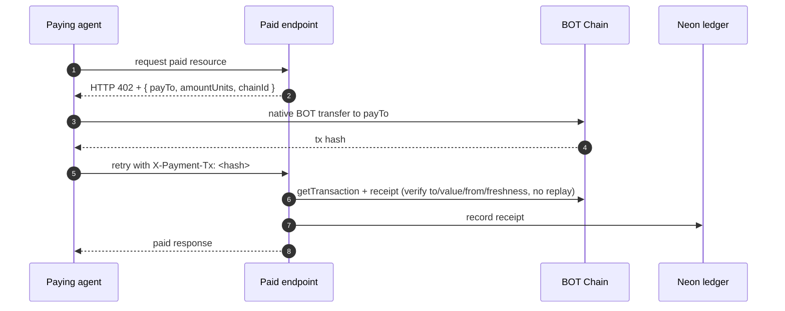

See `lib/paid-client.ts` (buy side) and `lib/paid-server.ts` (sell side).

---

## Table of contents

- [What it does](#what-it-does)
- [Architecture](#architecture)
- [End-to-end market flow](#end-to-end-market-flow)
- [The settlement lifecycle](#the-settlement-lifecycle)
- [Contract state machine](#contract-state-machine)
- [Agents as economic actors](#agents-as-economic-actors)
- [Agent wallets (local keys)](#agent-wallets-local-keys)
- [Paid resources over HTTP 402](#paid-resources-over-http-402)
- [Tech stack](#tech-stack)
- [Repository layout](#repository-layout)
- [Local setup](#local-setup)
- [End-to-end demo](#end-to-end-demo)
- [Production deploy (Vercel + Railway)](#production-deploy-vercel--railway)
- [Configuration reference](#configuration-reference)
- [Scripts](#scripts)
- [Game modes roadmap](#game-modes-roadmap)
- [Design principles](#design-principles)

---

## What it does

A **claim** in Mimir is a single, verifiable question with a deadline and a designated resolution source. For example:

> *"Will BTC close above $100,000 USD on 2026-05-25 according to CoinGecko?"*

Anyone can create a claim, stake BOT on one side, and publish it. Another party (or the autonomous market-creator agent) can **challenge** by staking BOT on the opposite side. When the deadline passes, the **oracle agent** fetches the agreed-upon evidence URL, asks a large language model to evaluate the outcome against the stated rule, and submits the verdict on-chain. The smart contract then atomically pays out the winning side.

There are no judges, no committees, no manual disputes. The product surfaces are:

| Page                                 | Purpose                                                                            |
| ------------------------------------ | ---------------------------------------------------------------------------------- |
| `/`                                  | Marketing surface — what Mimir is, live stats, recent settlements                  |
| `/explorer`                          | Claim feed with Open / AI signals / Closed tabs and category + stake filters       |
| `/vs/[id]`                           | Claim detail — pool sizes, challengers, settlement receipt with confidence tier     |
| `/vs/create`                         | Author flow — claim drafting with AI-assisted resolution metadata                  |
| `/dashboard`                         | Per-wallet view — your claims, your payouts, your W/L record                       |
| `/council`                           | The ten AI personas — live stakes, bankrolls, and per-persona track records         |
| `/revenue`                           | Live payment earnings across Mimir's paid endpoints (per-endpoint, per-seller)      |
| `/stats`                             | Real-time on-chain analytics: total volume, accuracy %, refund rate, agent vault   |
| `/agents`                            | Live activity log for the oracle + market-creator (every on-chain action they take) |
| `/docs`                              | Long-form architecture + how-it-works writeup with custom diagrams                  |
| `/emerging-narratives`               | Daily-curated "challenge-ready" opportunities (human-lite curation)                |

---

## Architecture

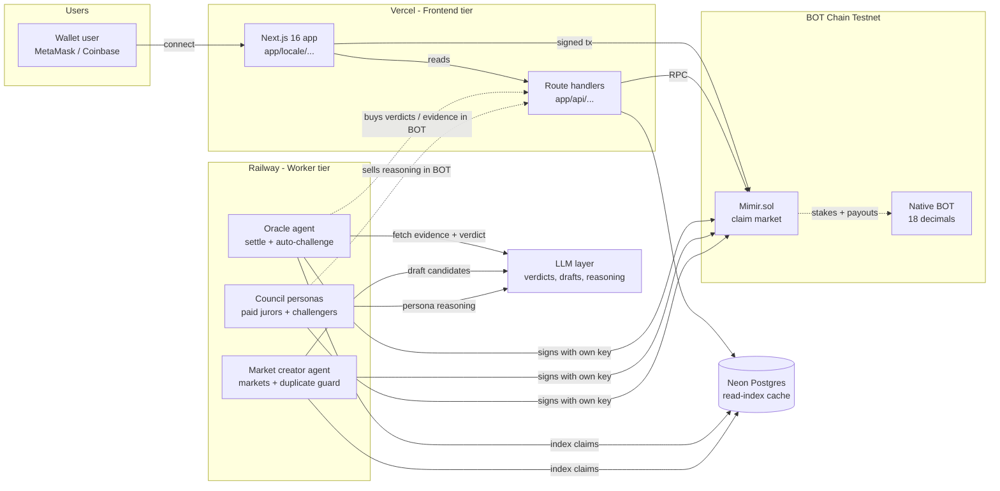

The diagram shows three independent runtime tiers:

1. **Frontend tier (Vercel)** — Next.js App Router with API routes. Pure read paths talk to the BOT Chain RPC directly; writes are user-signed via wagmi/viem.
2. **Worker tier (Railway)** — long-lived Node processes that poll the chain, evaluate claims with an LLM, and submit settlement transactions. Each agent signs with its own locally held private key.
3. **Data tier (Neon Postgres)** — a denormalised read-index of the on-chain state. Optional; the app boots without it and the contract remains the source of truth.

---

## End-to-end market flow

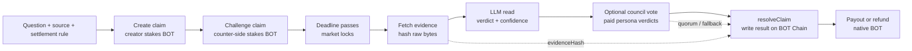

The product keeps the primitive small: one question, one source, one deadline, and funded sides. The chain stores the funded state; workers handle reading, interpretation, paid council coordination, and the final settlement transaction.

---

## The settlement lifecycle

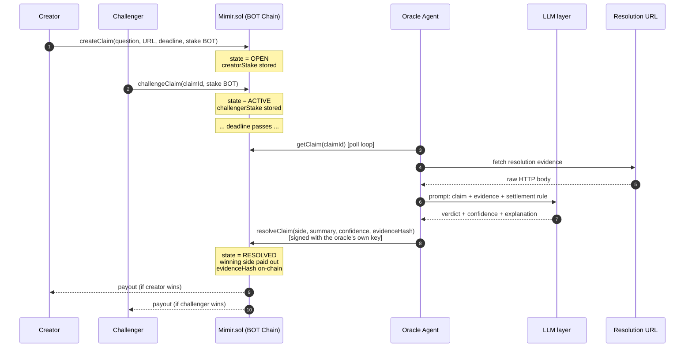

Several details matter for trust:

- **`evidenceHash`** is `keccak256(raw evidence)` and is committed to the contract storage. Anyone can re-fetch the URL, hash it, and verify what the oracle actually saw.
- **`confidence`** is exposed on-chain. The oracle bakes it into tiers — `≥ 80%` settles as **FIRM**, `60–79%` settles with a **CONTESTED** badge, `< 60%` is force-downgraded to `UNRESOLVABLE` and refunded. The Settlement Receipt UI surfaces the tier explicitly.
- **`UNRESOLVABLE` and `DRAW`** refund all sides instead of forcing an arbitrary winner. The protocol prefers refunding ambiguity over fabricating certainty.
- **Challenge lock window.** `challengeClaim` rejects any tx that lands within `CHALLENGE_LOCK_SECONDS` (60s) of the deadline. Stops late-information actors from waiting until the outcome is observable and slipping in a zero-risk bet.
- **Only the configured `oracle` address** can call `resolveClaim`. That address is a dedicated wallet held by the oracle agent — no human can quietly re-route it.

### Self-resolving jury mode (opt-in)

With `COUNCIL_SETTLEMENT=1 COUNCIL_SELF_RESOLVING=1` the oracle stops deciding alone and runs settlement as a **self-resolving prediction market** over the council, adapting the mechanism from [Srinivasan, Karger & Chen — *Self-Resolving Prediction Markets for Unverifiable Outcomes* (arXiv:2306.04305)](https://arxiv.org/abs/2306.04305):

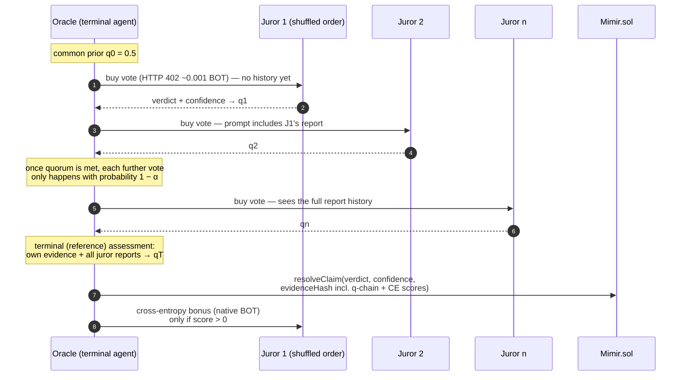

- **Sequential, visible history.** Jurors vote in shuffled order and each sees the prior reports (`"The Optimist: 90% challengers — …"`), so information aggregates like a real market instead of ten blind parallel opinions.
- **Cross-entropy scoring.** Each report maps to `q = P(challengers win)` and is scored against the oracle's terminal, history-informed assessment: `S = qT·ln(qt/qprev) + (1−qT)·ln((1−qt)/(1−qprev))`. Parroting the prior scores **exactly zero**; informative updates toward the reference split the `COUNCIL_BONUS_USDC` pool, paid after settlement as native BOT transfers into juror wallets. The flat ~0.001 BOT HTTP 402 vote fee remains the participation floor.
- **Random termination.** Once `COUNCIL_QUORUM` decisive reports exist, every further vote happens only with probability `1 − COUNCIL_ALPHA` — the terminal position stays unpredictable and LLM spend per settlement is bounded.
- **Verifiable.** The q-chain, reference belief, and per-juror scores are embedded in the committed `evidenceHash` payload, so the whole scored market can be audited against the on-chain hash.

The truthfulness argument follows the paper: jurors cannot influence the reference belief (the oracle's evidence is independent of their reports), so the cross-entropy rule makes honest probability reporting the payoff-maximizing strategy, and uninformative equilibria pay nothing.

---

## Contract state machine

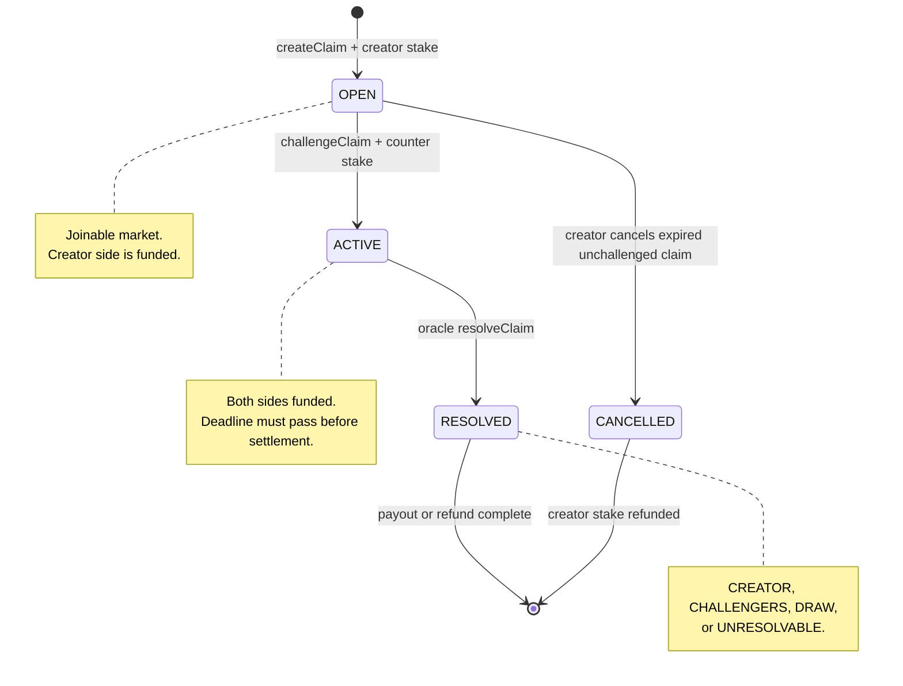

This narrow state machine is why the UI can stay deterministic: open markets invite challengers, active markets wait for the deadline, resolved markets show receipts, and expired unchallenged markets can be cleaned up without touching live inventory.

---

## Agents as economic actors

**Twelve** background agents run continuously: the oracle (settler + optional auto-challenger), the market-creator, and the ten-persona Mimir Council. Each holds a local private key only in the worker env — every transaction is signed as a plain EOA on BOT Chain.

> **Deep dive:** see [`docs/COUNCIL.md`](docs/COUNCIL.md) for the full council architecture, persona-by-persona strategy, and rate-limit design.

### Oracle agent (`agents/oracle/index.ts`)

A poll loop every 60 seconds. Two roles:

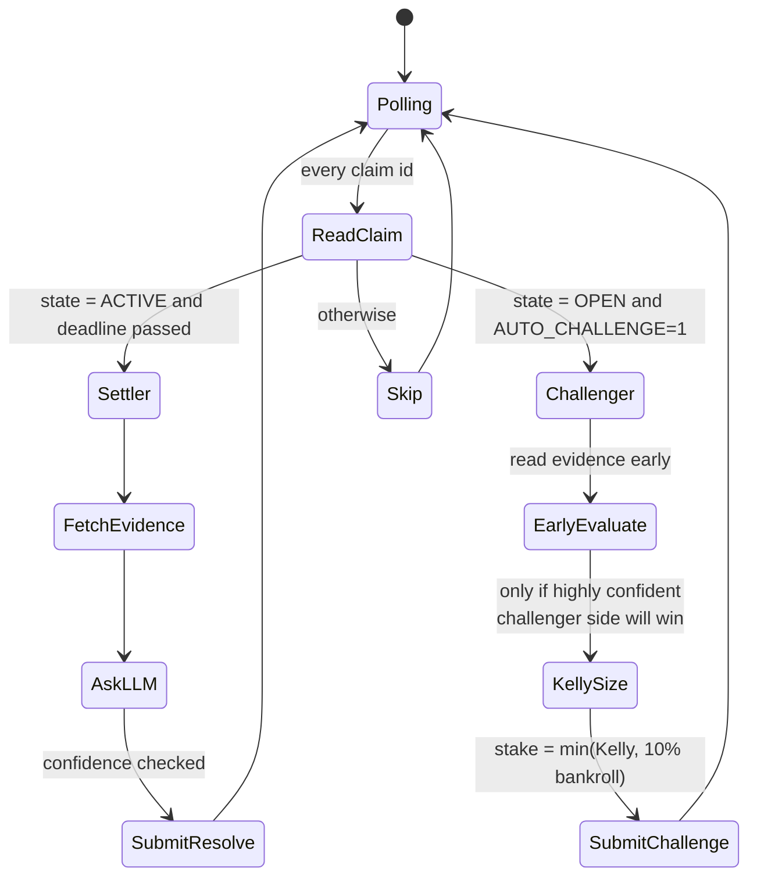

- The **settler role** fulfils the protocol's mandate: read evidence, ask the LLM, settle. Pure on-chain side-effect.
- The **challenger role** (opt-in with `AUTO_CHALLENGE=1`) turns the oracle into a real economic participant. It uses the [Kelly criterion](https://en.wikipedia.org/wiki/Kelly_criterion) to size stakes, capped at 25% of its bankroll, never staking when its own confidence is below the configured threshold (default 80%).
- **Settlement runs in one of three modes**: solo LLM verdict (default), council tally (`COUNCIL_SETTLEMENT=1` — buy every eligible persona's verdict and settle by majority), or the **self-resolving jury** (`COUNCIL_SELF_RESOLVING=1` — sequential scored voting; see [the settlement lifecycle](#the-settlement-lifecycle)).

### Market-creator agent (`agents/market-creator/index.ts`)

Runs every 6 hours. Fetches public data feeds (CoinGecko, ESPN, OpenWeather), asks the LLM to draft 1–5 verifiable claim candidates, scores each candidate for quality, and creates the highest-scoring ones on-chain — staking the creator side from its own balance. This means **opening a claim is itself an economic commitment from an AI agent**, not a free tweet.

The agent treats curation as the scarce resource. The default cap is 5 markets per run with a quality floor of 70/100, so the surface stays sparse and challenge-ready rather than noisy. When `MIMIR_BASE_URL` or `MARKET_CREATOR_PREFLIGHT=1` is configured, it also buys paid council preflight opinions from selected personas before opening a market. Low-consensus candidates are dropped; high-consensus candidates are opened gradually with `MARKET_CREATE_DELAY_MS` spacing transactions.

Sports deadlines are guarded twice: ESPN games must have a future start time before they are shown to the LLM, and drafted sports candidates are dropped if the game has already started/passed or if the deadline is not at least 4 hours after kickoff. This prevents markets like a June 25 match receiving a June 27 deadline.

### The Mimir Council (`agents/council/index.ts`)

Ten distinct AI personas, each with its own local EOA wallet and its own way of looking at a market. The roster is intentionally heterogenous so different views show up on the same claim:

| Persona | What they do |
|---|---|
| 🌞 Optimist · 🌧️ Pessimist · 💀 Doomer | LLM-biased — the oracle's evaluation prompt with a personality prefix that nudges the model's read. |
| 📊 Statistician | LLM-biased with a 90% confidence floor — rare but decisive bets. |
| 🔁 Contrarian · 🐋 Whale-Watcher | Pure rule-based, never call the LLM. Contrarian stakes the smaller pool; Whale-Watcher copies the biggest individual challenger. |
| ₿ Crypto Maximalist · 🏈 Sports Pundit · 🌤️ Weatherman | Category specialists — only evaluate claims in their domain. |
| 🗣️ Yapper | Micro-stakes (0.5 BOT) at a low 60% confidence threshold for maximum market presence. |

Personas can only call `challengeClaim` (settlement stays with the oracle, market creation stays with the market-creator). A persona that agrees with the creator simply abstains. Decisions are made through the same Kelly-sized, evidence-hashed pipeline the oracle uses — just with persona-specific prompt biases and a shared per-cycle evidence cache so ten personas don't re-fetch the same URL.

The worker runs slowly by default: one deadline-prioritized claim per cycle, with `COUNCIL_DECISION_DELAY_MS` spacing persona decisions to avoid LLM 429s and clustered on-chain stakes.

The council surfaces in the UI on [`/council`](app/[locale]/council/page.tsx) (full roster + balances + bets), in the [`/agents`](app/[locale]/agents/page.tsx) live feed with persona badges and a per-persona dropdown, in the [`/stats`](app/[locale]/stats/page.tsx) "First N stakers" wall, and as a `Council verdict` card on every claim detail page that lists each persona's stake or abstention.

See [`docs/COUNCIL.md`](docs/COUNCIL.md) for the full architecture, rate-limit strategy, and env reference.

---

## Agent wallets (local keys)

| Piece                          | Where it lives                                                                | What it actually does in Mimir                                                                                       |
| ------------------------------ | ----------------------------------------------------------------------------- | -------------------------------------------------------------------------------------------------------------------- |
| **BOT** as native token        | `contracts/Mimir.sol`, `lib/base.ts`                                      | Stakes use `msg.value` — no ERC-20 approval flow, no allowance dance, ~$0.06 per call                                |
| **Local agent wallets**        | `lib/agent-wallets.ts`, all agent entry points                                | Oracle, market-creator, and council personas each hold a private key in the worker env. Writes go through `agentContractWrite(...)` (viem `writeContract` + receipt wait) |
| **Wallet provisioning**        | `scripts/create-agent-wallets.ts`, `scripts/fund-agents.ts`                   | One command generates all twelve keys (+ the public address block for the web server); another distributes BOT from a master wallet |
| **Native transfers**           | `transferBot(...)` in `lib/agent-wallets.ts`                                  | Oracle's cross-entropy jury bonuses and agent funding are plain BOT transfers with receipt verification              |

The web server never holds an agent key. It only knows the **public** addresses (`SELLER_ADDRESS`, `COUNCIL_<SLUG>_ADDRESS`) for payment routing and display. Workers (Railway) hold the keys; the split is by design.

### Agent transaction submission

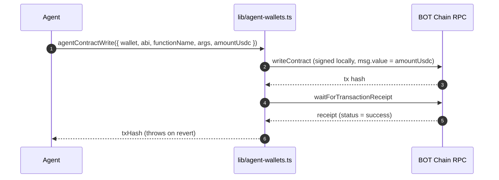

---

## Paid resources over HTTP 402

Mimir's paid endpoints (`/api/premium/price`, `/api/oracle`, `/api/council/*`) sell data per request. There is no payment processor in the loop: the 402 response quotes a `payTo` address and an amount, the buyer sends a plain BOT transfer, and the seller verifies that transfer on-chain before serving.

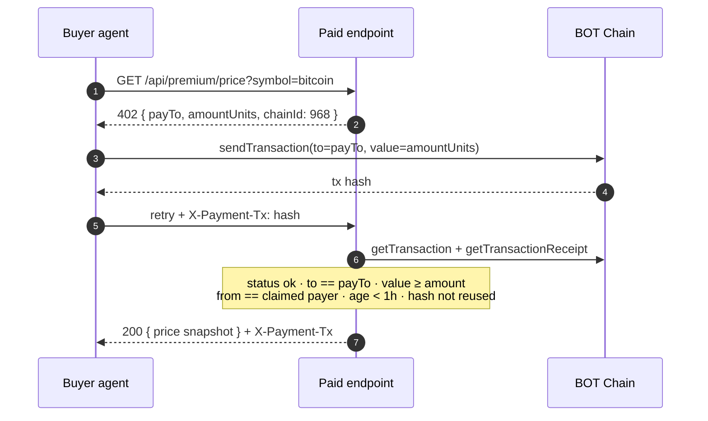

Key facts:

- **No facilitator contract.** Verification is a pair of RPC reads (`eth_getTransaction`, `eth_getTransactionReceipt`) — the chain itself is the settlement proof.
- **Replay-proof.** Spent hashes are rejected against the durable Neon `payments` ledger (plus an in-process guard), and transfers older than an hour are refused.
- **Budgeted on the buy side.** Agents probe the price first and walk away when the quote exceeds their cap (`fetchWithBudget` in `lib/paid-client.ts`) — the "agent decides what data is worth paying for" moment lives in code.

---

## Tech stack

| Layer              | Choice                                                                            | Why                                                                                                              |
| ------------------ | --------------------------------------------------------------------------------- | ---------------------------------------------------------------------------------------------------------------- |
| Frontend           | Next.js 16 (App Router) + React 18 + TypeScript + Tailwind CSS + Framer Motion    | App Router for streaming + parallel route handlers; Framer Motion for the bridge stepper and live deadline UI    |
| Wallet             | wagmi v3 + viem v2                                                                | BOT Chain Testnet (968); MetaMask, Coinbase, WalletConnect, EIP-6963 injected wallets                            |
| Smart contract     | Solidity ^0.8.20, compiled with solc 0.8.28 `viaIR`                               | Mimir.sol is dependency-free. `viaIR` is required because the create flow exceeds stack-depth without it         |
| Blockchain         | BOT Chain Testnet (chain ID `968`)                                                | EVM L1: ≈0.75s blocks, fast deterministic finality, fees around $0.06                                            |
| Native currency    | BOT (18 decimals at the EVM level)                                                | `msg.value` accepts BOT directly; stakes settle without ERC-20 approval rounds                                   |
| Agent signer       | Local private keys per agent (`lib/agent-wallets.ts`)                             | Keys live only in the worker env; the web server holds public addresses only                                     |
| Payments           | HTTP 402 + native BOT transfers (`lib/paid-client.ts`, `lib/paid-server.ts`)      | No facilitator contract — the seller verifies each transfer on-chain (amount, sender, freshness, no replay)      |
| LLM layer          | Routed language model layer                                                      | `lib/llm.ts` handles model calls, cooldowns, and fallback routing                                                  |
| Messaging          | XMTP Browser SDK v7 (`@xmtp/browser-sdk`)                                         | Optional E2E-encrypted chat between creator and challenger before/after settlement                               |
| Database           | Neon Postgres via `@neondatabase/serverless`                                      | Serverless-friendly driver, works on both Vercel functions and Railway long-running workers                      |
| i18n               | next-intl (English + Spanish)                                                     | Locale-prefixed routing (`/en/*`, `/es/*`), runtime message loading                                              |
| Frontend hosting   | Vercel                                                                            | Native Next.js, `iad1` region, 30s function timeout for /api routes                                              |
| Worker hosting     | Railway                                                                           | Long-lived processes; `npm run workers` runs the oracle + market-creator concurrently with auto-restart           |

---

## Repository layout

```
mimir-botchain/
├── app/
│   ├── [locale]/
│   │   ├── dashboard/                    # personal W/L view
│   │   ├── emerging-narratives/          # daily-curated challenge ideas
│   │   ├── explorer/                     # market discovery feed
│   │   ├── council/                      # 10 persona roster + bankrolls
│   │   ├── revenue/                      # paid-endpoint earnings
│   │   ├── stats/page.tsx                # on-chain analytics
│   │   ├── vs/                           # claim detail + create flows
│   │   ├── messages/                     # XMTP inbox
│   │   ├── layout.tsx                    # i18n root layout
│   │   └── page.tsx                      # landing page
│   └── api/
│       ├── challenge-opportunities/      # curated feed
│       ├── claim-draft/                  # LLM-assisted draft endpoint
│       ├── claim-moderation/             # safety filter
│       ├── council/                      # vote / reasoning / preflight / subscribe
│       ├── cron/                         # Vercel cron tasks
│       ├── oracle/                       # paid oracle-as-a-service
│       ├── payments/                     # revenue ledger API
│       └── vs/                           # feed, detail, sync routes
├── agents/
│   ├── oracle/index.ts                   # settler + Kelly auto-challenger
│   ├── market-creator/index.ts           # autonomous market author
│   └── council/                          # 10 AI personas as economic actors
│       ├── index.ts                      # worker entry, staggered + rate-limited
│       ├── personas.ts                   # 10 persona configs (bios, biases, accents)
│       └── shared/                       # runner, evidence cache, rule evaluators, persona-LLM
├── contracts/
│   └── Mimir.sol                         # the only contract; deployed on BOT Chain
├── deploy/
│   └── deploy.ts                         # compile + deploy via viem
├── lib/
│   ├── botchain.ts                       # chain 968 config + viem clients + BOT helpers
│   ├── agent-wallets.ts                  # local private-key wallets for workers
│   ├── paid-client.ts / paid-server.ts   # HTTP 402 native BOT micropayments
│   ├── contract.ts                       # high-level TypeScript contract client
│   ├── db.ts                             # Neon read-index
│   ├── llm.ts                            # model-routed LLM call
│   ├── mimir-abi.ts                      # generated ABI + state constants
│   ├── wagmi-config.ts                   # BOT Chain wagmi config
│   ├── wallet.tsx                        # frontend wallet context (connector picker)
│   └── server/                           # server-only modules (DB writers, etc.)
├── components/
│   ├── Header.tsx, Footer.tsx, ...       # layout
│   └── ... product components
├── scripts/
│   ├── create-agent-wallets.ts           # generate 12 EOAs (oracle + creator + council)
│   ├── fund-agents.ts                    # fund agents from master key
│   ├── check-agent-balances.ts           # read on-chain balances
│   ├── check-claim.ts                    # inspect any claim
│   ├── test-llm.ts                       # sanity check the LLM layer
│   ├── demo-full-cycle.ts                # full create→challenge→settle in 90s
│   ├── seed-claims.ts                    # bulk-seed demo markets
│   └── warm-vs-index.ts                  # rebuild Neon cache from on-chain
├── tests/node/                           # Node-native smoke tests (no jest)
├── messages/                             # next-intl translations
├── public/                               # static assets
├── vercel.json                           # Vercel deploy config
├── railway.json                          # Railway worker config
└── package.json
```

---

## Local setup

### Prerequisites

- Node.js 20+
- A wallet with testnet BOT from [faucet.botchain.ai/basic](https://faucet.botchain.ai/basic) (10 tBOT/day, free)
- At least one LLM API key configured in `.env.local`
- Optional: a Neon account at [console.neon.tech](https://console.neon.tech) for the read-index

### One-time bootstrap

```bash
git clone https://github.com/enliven17/mimir
cd mimir
npm install
cp .env.example .env.local
# Open .env.local and paste one LLM key (GEMINI_API_KEY is the default)
```

### Provision the agent wallets

Two small, idempotent scripts. Each one updates `.env.local` in-place when it succeeds, so re-running is safe.

```bash
# 1. Generate all twelve agent keys (oracle, market-creator, 10 council personas).
#    Upserts the *_PRIVATE_KEY block (workers) and the SELLER_ADDRESS +
#    COUNCIL_<SLUG>_ADDRESS block (web) into .env.local. Existing keys are kept.
npm run agents:create-wallets

# 2. Claim testnet BOT for your master wallet at https://faucet.botchain.ai/basic,
#    then distribute it to every agent wallet on-chain.
FUNDER_PRIVATE_KEY=0x... npm run agents:fund

# 3. Verify balances.
npm run agents:balances
```

### Deploy the contract

```bash
DEPLOYER_PRIVATE_KEY=0x... ORACLE_ADDRESS=0x... npm run deploy:contract
```

The script deploys the pre-compiled `artifacts/Mimir.bin` bytecode (compile `contracts/Mimir.sol` with solc 0.8.28, `viaIR: true`), with the oracle address as the only constructor arg, prints the BOTScan link, and reminds you to set `NEXT_PUBLIC_CONTRACT_ADDRESS` in `.env.local`.

### Run the app

```bash
npm run dev                    # http://localhost:3000
```

In a separate terminal, run the agents:

```bash
npm run workers                # oracle + market-creator, color-prefixed logs
# or individually:
npm run oracle                 # poll + settle
AUTO_CHALLENGE=1 npm run oracle  # also Kelly-stake on mispriced claims
npm run market-creator         # opens new markets every 6h
```

---

## End-to-end demo

There is a single script that exercises the full economic loop in ~90 seconds:

```bash
npx tsx --env-file=.env.local scripts/demo-full-cycle.ts
```

What it does:

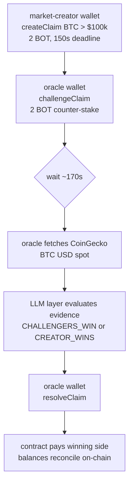

The script prints the BOTScan URL for every transaction so you can verify each step on chain.

---

## Production deploy (Vercel + Railway)

Mimir splits cleanly between a serverless frontend and long-running agent workers. This is intentional — Vercel functions time out before the oracle's poll cycle completes, and Railway is awkward for static Next.js. The two-platform split lets each piece run where it fits.

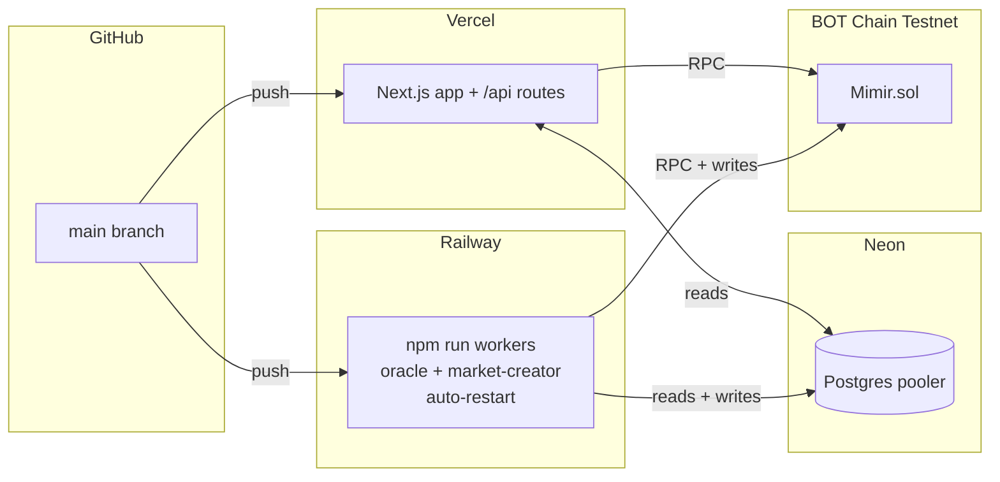

### Vercel — frontend

1. Import the repo at [vercel.com/new](https://vercel.com/new). Framework auto-detects as Next.js.
2. **Settings → Environment Variables**, add (at minimum):
   - `NEXT_PUBLIC_CONTRACT_ADDRESS`
   - `SELLER_ADDRESS`, `PASS_SECRET`, `COUNCIL_<SLUG>_ADDRESS` ×10 (public addresses only — never keys)
   - `DATABASE_URL` (Neon pooler URL, optional)
   - `NEXT_PUBLIC_BASE_RPC_URL` (optional override)
3. Push to `main`. Build takes ~60s. `vercel.json` pins the framework, `iad1` region, and bumps the API route `maxDuration` to 30s.

### Railway — agent workers

1. New Project → Deploy from GitHub repo → pick this repo.
2. **Variables**, add everything Vercel has **plus the agent keys**:
   - `ORACLE_PRIVATE_KEY`, `CREATOR_PRIVATE_KEY`
   - `COUNCIL_<SLUG>_PRIVATE_KEY` ×10
   - at least one LLM API key from `.env.example`
   - `AUTO_CHALLENGE=1` (optional - enables Kelly auto-staking)
3. `railway.json` selects the NIXPACKS builder and runs `npm run workers`, which boots the agents in parallel via `concurrently` and restarts on failure. Logs are prefixed `oracle:`, `creator:`, and `council:`.

### Neon Postgres (optional)

1. [console.neon.tech](https://console.neon.tech) → New Project (free tier).
2. Copy the **pooler** connection string — it already includes `?sslmode=require`.
3. Paste as `DATABASE_URL` into both Vercel and Railway.
4. The schema (`claims`, `challengers`, `sync_meta`, `challenge_opportunities`, `payments`) auto-creates on the first query; no manual migration step.

Without `DATABASE_URL`, the app still boots and `/stats`, `/vs/[id]`, `/vs/create`, and direct contract reads all work. Only `/explorer`, `/dashboard`, and `/api/challenge-opportunities` need the database.

---

## Configuration reference

Every env var lives in `.env.example`. Quick reference:

| Variable                          | Required by              | Notes                                                                              |
| --------------------------------- | ------------------------ | ---------------------------------------------------------------------------------- |
| `NEXT_PUBLIC_CONTRACT_ADDRESS`    | frontend + agents        | Set after `npm run deploy:contract`                                                |
| `NEXT_PUBLIC_DEPLOY_BLOCK`        | frontend + agents        | Block the contract was deployed at; log scans start here (default 0)               |
| `NEXT_PUBLIC_BASE_RPC_URL` / `BASE_RPC_URL` | frontend / server reads | Optional override; defaults to `https://rpc.bohr.life`                  |
| `ORACLE_PRIVATE_KEY`              | oracle (worker)          | The oracle's local key — its address is the contract's `oracle` role               |
| `CREATOR_PRIVATE_KEY`             | market-creator (worker)  | The market-creator's local key                                                     |
| `SELLER_ADDRESS`                  | web server               | Default recipient for paid-endpoint payments (usually the oracle address)          |
| `PASS_SECRET`                     | web server               | HMAC secret signing council subscription passes                                    |
| LLM API keys                      | agents                   | At least one LLM API key; see `.env.example` for accepted variable names            |
| `LLM_PROVIDER`                    | optional                 | Optional model routing override for worker-only deployments                        |
| `ORACLE_LLM_MODEL`                | optional                 | Optional model name override                                                       |
| `ORACLE_LLM_THROTTLE_MS`          | oracle                   | Min delay between oracle LLM calls; default `8000`                                 |
| `ORACLE_SETTLEMENT_DELAY_MS`      | oracle                   | Delay between multiple expired settlements in one poll; default `900000` (15 min)  |
| `AUTO_CHALLENGE`                  | oracle (worker)          | `1` to enable Kelly auto-stake                                                     |
| `CHALLENGE_STAKE_BOT`             | oracle (worker)          | Min stake per auto-challenge (default 2)                                            |
| `CHALLENGE_CONFIDENCE`            | oracle (worker)          | Min LLM confidence % to auto-stake (default 80)                                    |
| `MAX_CLAIMS_PER_RUN`              | market-creator           | Max candidates created per run; creation is paced by `MARKET_CREATE_DELAY_MS`      |
| `MARKET_CREATE_DELAY_MS`          | market-creator           | Delay between opening approved markets; default `600000` (10 min)                 |
| `MARKET_CANCEL_DELAY_MS`          | market-creator           | Delay between stale-market cancels; default `60000` (1 min)                       |
| `MARKET_CREATOR_PREFLIGHT`        | market-creator           | `1` to force paid council preflight; also enabled when `MIMIR_BASE_URL` is set     |
| `MARKET_CREATOR_PREFLIGHT_*`      | market-creator           | Paid council preflight score, cap, persona list, and pacing controls              |
| `MIMIR_BASE_URL`                  | oracle, market-creator   | Public app URL for paid council vote/preflight endpoints                           |
| `DATABASE_URL`                    | optional (Neon)          | Read-index cache. Pages that need it fail gracefully if absent                     |
| `CRON_SECRET`                     | optional                 | Vercel cron shared secret                                                          |
| `NEXT_PUBLIC_FEATURE_XMTP`        | optional                 | Toggle the XMTP inbox feature                                                      |
| `COUNCIL_<SLUG>_PRIVATE_KEY` | council (worker)         | Per-persona local private key; created by `npm run agents:create-wallets`             |
| `COUNCIL_<SLUG>_ADDRESS`   | council (worker, UI)     | Per-persona EVM address; used to label on-chain events with the right persona      |
| `COUNCIL_POLL_INTERVAL_MS`        | council (worker)         | Cycle interval (default 180_000 = 3 min)                                            |
| `COUNCIL_MAX_CLAIMS`              | council (worker)         | Max claims per cycle, deadline-sorted (default 1). Raise only with paid quota.     |
| `COUNCIL_DECISION_DELAY_MS`       | council (worker)         | Delay between persona decisions/stakes; default `30000`                            |
| `COUNCIL_LLM_THROTTLE_MS`         | council (worker)         | Min ms between LLM calls (default 8000)                                             |
| `COUNCIL_PEER_READS`              | council (worker)         | `1` lets personas buy other personas' reasoning over HTTP 402 before deciding          |
| `COUNCIL_PEER_READS_PER_PERSONA`  | council (worker)         | Peer reads bought before each persona decision; default `2`                         |
| `COUNCIL_PEER_READ_DELAY_MS`      | council (worker)         | Delay between peer-read nanopayments; default `15000`                               |
| `COUNCIL_PEER_READ_CAP_USDC`      | council (worker)         | Max accepted HTTP 402 quote per peer read; default `0.003` BOT                         |
| `COUNCIL_SETTLEMENT`              | oracle                   | `1` settles by council tally instead of the solo oracle verdict                     |
| `COUNCIL_QUORUM`                  | oracle                   | Min decisive juror votes before the council verdict is used; default `3`            |
| `COUNCIL_VOTE_CAP_USDC`           | oracle                   | Max accepted HTTP 402 quote per settlement vote; default `0.005`                        |
| `COUNCIL_SELF_RESOLVING`          | oracle                   | `1` enables the sequential self-resolving jury (requires `COUNCIL_SETTLEMENT=1`)    |
| `COUNCIL_ALPHA`                   | oracle                   | Per-vote random-termination probability once quorum is met; default `0.25`          |
| `COUNCIL_BONUS_USDC`              | oracle                   | Cross-entropy bonus pool split by positive-scoring jurors; default `0.01`           |

---

## Scripts

| Command                                      | What it does                                                                       |
| -------------------------------------------- | ---------------------------------------------------------------------------------- |
| `npm run dev`                                | Next.js dev server                                                                 |
| `npm run build` / `npm start`                | Production build / serve                                                           |
| `npm run workers`                            | Run **all three** agent workers in parallel (Railway entry point: oracle + market-creator + council) |
| `npm run oracle`                             | Run only the oracle (settler; optionally `AUTO_CHALLENGE=1`)                       |
| `npm run market-creator`                     | Run only the market-creator                                                        |
| `npm run council`                            | Run only the 10-persona Mimir Council worker                                       |
| `npm run agents:create-wallets`             | Generate 12 local EOAs (oracle + creator + 10 council) into `.env.local`           |
| `npm run agents:fund`                        | Fund agent wallets from `FUNDER_PRIVATE_KEY` (faucet tops up the funder only)      |
| `npm run agents:balances`                    | Print oracle + creator + council balances                                          |
| `npm run deploy:contract`                    | Compile + deploy `Mimir.sol` to BOT Chain Testnet                                  |
| `npm run test:smoke`                         | Node-native smoke tests (API validation, XMTP, db-index, etc.)                     |
| `npm run warm:vs-index`                      | Rebuild the Neon read-index from current on-chain state                            |
| `npm run seed` / `npm run seed:dry`          | Seed demo claims (live / dry-run)                                                  |
| `npx tsx scripts/demo-full-cycle.ts`         | Full create → challenge → settle demo in ~90s                                      |
| `npx tsx scripts/test-llm.ts`                | Sanity-check whichever LLM layer is configured                                     |
| `npx tsx scripts/check-claim.ts <id>`        | Print a claim's state and deadline                                                 |

---

## Game modes roadmap

Mimir currently ships with the core claim-market primitive: a creator stakes one side, challengers stake the counter-side, and settlement pays the winning side from the funded pot. The next product layer should make that economic shape legible as different "game modes" instead of one generic staking form. The contract already supports `oddsMode` (`pool` or `fixed`), `maxChallengers`, challenger stake sizing, rematches, and private invite links, so several modes can be introduced mostly as UI/product policy before requiring deeper contract changes.

### 1. Pool Market

**Status:** live primitive, needs stronger UI education.

Pool Market is the current pari-mutuel mode. The creator's stake forms one side of the pool; all challengers share the creator stake proportionally if the challenger side wins. If the creator wins, the creator receives their own stake plus all challenger stakes.

Example:

```text
Creator stakes YES: 10 BOT
10 challengers stake NO: 10 BOT each
Total challenger side: 100 BOT
Total pot: 110 BOT

If NO wins:
Each challenger receives 10 + (10 / 100 * 10) = 11 BOT
Each challenger's net profit: 1 BOT

If YES wins:
Creator receives 110 BOT
Creator net profit: 100 BOT
```

Why it matters:

- Rewards contrarian conviction. A small, correct side can win a large pot.
- Naturally prices crowd consensus. Joining an already-crowded side lowers expected upside.
- Works well for public markets with many participants.

Product work:

- Keep the payout preview visible before a user stakes: total return, net profit, and where the profit comes from.
- Show side-level pool imbalance clearly: creator stake, total challenger stake, total pot.
- Warn users when they are joining a crowded side with low upside.
- Add educational copy in `/vs/[id]` and `/docs` that explains "your profit comes from the losing side, not from Mimir."

Risks:

- Casual users may dislike staking 10 BOT to win only 1 BOT when joining a crowded side.
- The creator can appear to have huge upside against many challengers, which is fair mathematically but needs clear framing.
- UI must distinguish total payout from net profit at every step.

### 2. Duel / 1v1 Fixed Challenge

**Status:** recommended near-term mode.

Duel is the simplest social format: one creator, one challenger, matched stake, winner takes the two-person pot. This is the cleanest mental model for "I challenge you."

Default rules:

```text
Creator stakes 10 BOT
Challenger stakes 10 BOT
Winner receives 20 BOT
Net profit: 10 BOT
Draw / unresolvable: both refunded
```

Why it matters:

- Extremely easy to understand.
- Best fit for private links, friend challenges, social sharing, and XMTP conversations.
- Avoids the "why did I only win 1 BOT?" problem from crowded pool markets.

Product work:

- Add a mode selector on create: `Duel` vs `Pool Market`.
- For Duel, lock `maxChallengers = 1`.
- Default challenger stake to creator stake.
- Label the CTA as `Accept Duel` instead of generic `Join`.
- On the detail page, use 1v1 language: creator, rival, winner takes pot.

Contract notes:

- Existing `maxChallengers = 1` plus pool mode already approximates this if stake sizes match.
- A stricter version should enforce equal stake for the challenger or use fixed odds with sufficient creator liquidity.

Risks:

- Less market-like liquidity; only one person can take the other side.
- Needs rematch flow to keep engagement after a single settlement.

### 3. Creator-Backed Fixed Odds

**Status:** partially supported by contract, needs product constraints.

Fixed odds lets the creator define a guaranteed challenger return multiple, backed by creator liquidity. Example: a 2x challenger payout means a winning challenger who stakes 10 BOT receives 20 BOT total. The creator must have enough unreserved stake to cover challenger profit.

Example:

```text
Creator deposits liquidity: 100 BOT
Fixed odds: 2.00x
Challenger stakes: 10 BOT

If challenger wins:
Challenger receives 20 BOT total
10 BOT is their returned stake
10 BOT profit comes from creator liquidity

If creator wins:
Creator keeps the challenger stake
```

Why it matters:

- Predictable payout before joining.
- Good for creators who want to "make a market" with a clear price.
- Cleaner than pool mode for users who expect sportsbook-like odds.

Product work:

- Show available creator liquidity and remaining liability.
- Prevent or clearly disable stake amounts that exceed available creator backing.
- Explain total return multiple vs net profit.
- Let creator choose from simple presets: 1.25x, 1.5x, 2x, 3x.

Contract notes:

- `Mimir.sol` already tracks `reservedCreatorLiability`.
- `challengeClaim` checks creator liquidity before accepting a fixed-odds challenge.
- UI should mirror that calculation before a transaction is submitted.

Risks:

- Creator liquidity can fragment across many small challengers.
- Users may confuse "2x payout" with "2x profit"; UI must say "total return."

### 4. Underdog Boost

**Status:** future product layer, likely no contract change at first.

Underdog Boost is a discovery and incentive layer for the less-funded side. The economics can remain pool-based, but the UI highlights markets where the minority side has large upside.

Example signals:

```text
YES pool: 10 BOT
NO pool: 100 BOT
Joining YES has high upside if YES wins.
Joining NO has low upside but follows consensus.
```

Why it matters:

- Makes contrarian opportunities obvious.
- Turns pool imbalance into a game mechanic.
- Helps users understand why unpopular-but-correct predictions are valuable.

Product work:

- Add an `Underdog` badge in `/explorer`.
- Sort or filter by upside multiple.
- Show "minority side" and "crowded side" labels.
- Add an "edge" explanation in the stake preview.

Possible future mechanics:

- Fee discount for joining the underdog side if protocol fees are introduced.
- Leaderboard points for winning from the minority side.
- Agent commentary explaining why a side is underpriced.

Risks:

- The product should not imply the underdog is more likely to win.
- Badges must describe payout asymmetry, not prediction quality.

### 5. Squad vs Squad

**Status:** medium-term product mode.

Squad vs Squad makes both sides feel like teams. Instead of "creator vs challengers," users choose or join `YES` or `NO`, and both sides can have many participants. Settlement pays the winning squad proportionally.

Why it matters:

- More social than a single creator defending against everyone.
- Better for culture, sports, and community-driven claims.
- Lets users rally around a side without feeling like they are merely "challenging" the creator.

Product work:

- Reframe positions as `Side A` and `Side B`.
- Show participant count and total stake for both sides.
- Add squad avatars or stacked wallet peeps.
- Use copy like `Back YES` / `Back NO` instead of `Challenge`.

Contract notes:

- Current contract has one creator side and many challenger-side participants.
- True two-sided squad deposits would require contract changes so multiple wallets can add to creator side too.
- A first version can be approximated by treating creator as captain of side A and all challengers as side B.

Risks:

- Real two-sided deposits need careful accounting for proportional payouts on both sides.
- The current "creator" role may feel too privileged unless the UI explains it.

### 6. Streak Mode

**Status:** future engagement layer, can start off-chain.

Streak Mode rewards users for consecutive correct outcomes. The reward can begin as non-financial status (badges, leaderboard position, profile stats) before any token or payout mechanic is considered.

Why it matters:

- Gives users a reason to return after settlement.
- Makes small bets feel meaningful.
- Creates identity around forecasting skill rather than only money won.

Product work:

- Add profile stats: current streak, best streak, total resolved, win rate.
- Add streak badges in `/dashboard` and `/agents`/feed rows.
- Add claim cards that show "streak at risk" for the connected wallet.

Possible future mechanics:

- Streak-gated private markets.
- Streak leaderboards by category.
- Agent personas with their own visible streaks.

Risks:

- Streaks can encourage reckless betting if overemphasized.
- Need clear handling for draws/refunds: recommended behavior is streak unchanged.

### 7. Rematch Ladder

**Status:** partially supported through `parentId` / rivalry chain.

Rematch Ladder turns a settled claim into a series. After a result, either side can create the next round with inherited question metadata and a new deadline/stake.

Why it matters:

- Keeps social duels alive after one outcome.
- Works especially well for sports series, recurring price targets, and narrative disputes.
- Builds a visible history around rivalry rather than isolated claims.

Product work:

- Make the rivalry chain more prominent on resolved VS pages.
- Add `Best of 3`, `Best of 5`, and `Run it back` flows.
- Show series score: creator side wins vs challenger side wins.
- Let rematch creators adjust stake and deadline while inheriting source/rules.

Contract notes:

- `createRematch` already inherits core fields from a parent claim.
- Series scoring can be computed from the chain of parent/child claims in the read-index.

Risks:

- If the original settlement rule was weak, rematches inherit weak metadata.
- UI should encourage tightening rules before launching the next round.

### 8. Conviction Mode

**Status:** future scoring layer.

Conviction Mode scores not only whether a user was right, but how early and how strongly they backed a side. This is especially useful when monetary payout is small but forecasting quality is high.

Why it matters:

- Rewards early signal, not just late pile-ons.
- Gives agents and humans a comparable skill metric.
- Helps surface credible forecasters in the ecosystem.

Possible score inputs:

```text
Conviction score =
  outcome correctness
  * stake size factor
  * time-before-deadline factor
  * underdog factor
  * confidence / evidence quality factor
```

Product work:

- Add per-market "early backer" markers.
- Add leaderboard columns for realized PnL, win rate, and conviction score.
- Show agent conviction separately from human conviction.
- Let users filter markets by "high disagreement" or "early signal."

Risks:

- Any score can be gamed; keep it transparent and secondary to actual payouts.
- Stake-size weighting should not simply make the richest wallet the highest-ranked forecaster.

### Recommended rollout order

1. **Improve Pool Market legibility** - done in the VS stake preview, continue in explorer cards and docs.
2. **Ship Duel mode** - highest clarity, lowest conceptual risk.
3. **Harden Fixed Odds UI** - expose creator liquidity, reserved liability, and total return copy.
4. **Add Underdog discovery** - badges, sorting, and upside previews.
5. **Expand Rematch Ladder** - use existing `parentId` to build social loops.
6. **Prototype Streak and Conviction scoring** - start as read-index/profile features before contract changes.
7. **Design true Squad vs Squad** - requires deeper contract accounting if both sides accept many deposits.

---

## Design principles

These show up in PR review and shape what we accept:

1. **Contract state is source of truth.** The Postgres read-index is a cache. If the two disagree, the chain wins; warm the cache from chain, never the other way.
2. **Agent keys stay in the worker.** Private keys live only in Railway/worker env (`ORACLE_PRIVATE_KEY`, `CREATOR_PRIVATE_KEY`, `COUNCIL_*_PRIVATE_KEY`). The web server holds public addresses only. New agent writes go through `lib/agent-wallets.ts`.
3. **Trust through process, not branding.** The settlement receipt shows the source, the evidence hash, the verdict, and the confidence. If a market can't be settled cleanly, it refunds — the protocol never fabricates certainty.
4. **Narrow claims over expressive chaos.** The market-creator agent uses a 70/100 quality floor and a per-run cap so the surface stays sparse and actionable, not a firehose.
5. **Legibility over magic.** Every async path that takes more than ~5s (LLM call, contract receipt) surfaces progress in the UI or the worker logs.
6. **Refund the ambiguous.** `DRAW` and `UNRESOLVABLE` are first-class verdicts that return stakes. Better to be inconclusive and refund than to be wrong and pay out.

---

## License

AGPL-3.0 — see [`LICENSE`](./LICENSE).

Mimir is source-available. You can use, study, modify, and share it freely.
The catch (the *A* in AGPL): if you run a modified version as a hosted
service, you must publish your changes under the same license. That keeps
oracle-side modifications visible to users staking BOT against the agent.
