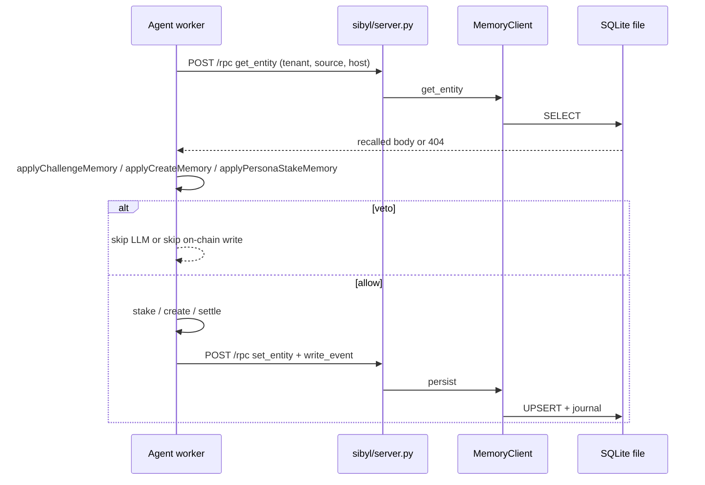

# Sibyl Memory in Mimir

**Persistent, load-bearing memory for the agents that stake and settle on Base.**

Mimir agents are TypeScript workers. Sibyl Memory is a Python SDK (`sibyl-memory-client`) that stores durable facts in a local SQLite file. There is no in-process stand-in, no mock, and no vector database. If you delete the SQLite file, the agents forget — and they stake, create, and challenge as if they had never seen those sources. That is the point.

Sibyl Labs ships the memory engine. Mimir only calls it. Every read and write in production goes through `MemoryClient.local(...)`.

---

## Table of contents

- [Why it exists](#why-it-exists)
- [Load-bearing, not decorative](#load-bearing-not-decorative)
- [Architecture](#architecture)
- [What gets stored](#what-gets-stored)
- [How a decision changes](#how-a-decision-changes)
- [Agents](#agents)
- [Local setup](#local-setup)
- [Railway](#railway)
- [Environment](#environment)
- [Tests](#tests)
- [Files](#files)

---

## Why it exists

Without memory, every poll cycle is amnesia. The oracle can keep staking into a resolution host that already returned `UNRESOLVABLE` twice. A council persona can keep trying a source it already walked away from. The market-creator can keep opening markets on a host the oracle has already learned is fog.

Sibyl is the file that survives process death. A fresh worker boots, recalls the host, and **does something different** — refuse the stake, skip the market, skip the LLM call.

Neon Postgres is not this. Neon is a read-index of on-chain claims. Contract state is the source of truth for money. Sibyl is the source of truth for *what this agent has already learned about a source*.

---

## Load-bearing, not decorative

The eligibility test from the Sibyl hackathon is also the engineering test:

> Delete the memory layer. If the product still does what it claims, it is a wrapper.

In Mimir that means:

1. Run an agent against a resolution URL that the LLM cannot settle (`UNRESOLVABLE`). Persist.
2. Do it again. Persist.
3. Kill the process.
4. Start a new process. The same LLM verdict at 92% **must not stake**. The gate reads the Sibyl entity and vetoes before (oracle) or instead of (council) throwing more USDC at the host.

If `SIBYL_REQUIRED` is on (default) and the sidecar is down, challenge / create / stake refuse. Settlement still runs: markets must not freeze because memory is unreachable. Persist after settle is best-effort.

---

## Architecture

```
┌─────────────────────────────────────────────────────────────┐
│  workers: oracle, market-creator, council, traders, sync    │
│                                                             │
│   lib/sibyl/memory.ts  →  HTTP 127.0.0.1:8788 /rpc          │
└──────────────────────────────┬──────────────────────────────┘
                               │
                               ▼
                    sibyl/server.py
                    MemoryClient.local(SIBYL_MEMORY_DB)
                               │
                               ▼
              SQLite + FTS5  (five-tier Sibyl schema)
              local file, no embeddings, no cloud store
```

TypeScript never opens the SQLite file. The sidecar is the only process that imports `sibyl_memory_client`.

On Railway, `scripts/start-workers.mjs` starts first: it builds a venv on the persistent volume (Nixpacks Python is PEP 668 locked — no system pip), installs the official wheel, boots `sibyl/server.py`, waits for `/health` (`engine: sibyl-memory-client`), then starts `npm run workers`. Locally, a worker can spawn the sidecar itself if nothing is listening.



---

## What gets stored

Sibyl tenants isolate identities. One machine, many agents, no leaked rows.

| Tenant | Who | Entity `source/<host>` |
|--------|-----|------------------------|
| `mimir-oracle` | Oracle | evaluations, challenges, settlements, unresolvable / draw / creatorWins / challengersWin, last verdict |
| `mimir-creator` | Market-creator | creates and skip-creates against a host |
| `mimir-council-<slug>` | Each council persona | evaluations, abstentions, stakes on that host |
| `mimir-trader-<agentId>` | Each BYOA trader | same shape as council |

The host key is the resolution URL hostname (`https://api.coingecko.com/api/v3/...` → `api.coingecko.com`). See `sourceKeyFromUrl` in `lib/sibyl/source-key.ts`.

On write we also append a journal event (`write_event`) so a later session can reconstruct *what happened*, not only the current entity.

The market-creator **reads the oracle tenant**, not its own, when deciding whether a host is unreliable. That is cross-agent recall on one Sibyl file.

---

## How a decision changes

Pure rules live in `lib/sibyl/policy.ts`. They never invent memory. They only consume a recalled body.

### Unreliable source (oracle + creator)

A host is unreliable when:

- `unresolvable >= 2`, and
- `unresolvable >= (challengersWin + creatorWins)`

Then:

- Oracle **does not call the LLM** for a challenge on that host.
- Market-creator **does not open** a market whose `resolutionUrl` is that host.

Same LLM verdict, empty memory → stake. Same verdict after two unresolvable persists → veto.

### Confidence penalty (oracle challenge)

Even before the hard veto, each unresolvable costs 8 confidence points and each draw costs 4, capped at 30. Kelly sizing uses the **adjusted** confidence. A 85% read with one unresolvable and two draws becomes 69% and misses an 80% floor.

### Persona source abstain (council + traders)

If a persona stood aside on a host **twice** and has **never** staked there, later cycles cannot stake there — including when the LLM now wants to. Category-filter skips and LLM failures are *not* written as abstentions (that would poison the record).

---

## Agents

| Worker | Recall | Persist |
|--------|--------|---------|
| Oracle challenge | Load oracle `source` before LLM; gate after verdict | Evaluate / challenge / veto; settle writes verdict buckets |
| Oracle settle | — | After `resolveClaim` succeeds (failure here does not revert the chain) |
| Market-creator | Oracle tenant source for the candidate URL | `create` or `skip-create` journal; create updates creator tenant |
| Council | Persona tenant source before LLM (and again before stake) | Abstain only when the persona actually judged the claim; stake after the tx |
| Traders | Trader tenant source after the model decides | Abstain or stake against the claim's `resolution_url` |

Sync does not use Sibyl. It indexes chain state into Neon.

---

## Local setup

Python 3.10+ and the official client:

```bash
pip install -r sibyl/requirements.txt
npm run sibyl                  # http://127.0.0.1:8788
npm run workers                # or a single agent: npm run oracle
```

Workers call `requireSibyl()` at boot. If nothing is listening they spawn `sibyl/server.py` and wait (`SIBYL_START_WAIT_MS`, default 12s locally / 25s on Railway).

Default DB: `~/.sibyl-memory/memory.db`. Override with `SIBYL_MEMORY_DB`.

Health check:

```bash
curl -s http://127.0.0.1:8788/health
# {"ok":true,"engine":"sibyl-memory-client","db":"...","schema_version":...}
```

---

## Railway

The `workers` service is Node-first (Nixpacks). Python is on the image, but Nix Python refuses system `pip` (immutable `/nix/store`).

`scripts/start-workers.mjs` therefore:

1. Creates `/data/sibyl` on the mounted volume.
2. Builds `/data/sibyl/venv` with `python3 -m venv --without-pip`.
3. Bootstraps pip via `get-pip.py` into that venv.
4. `pip install -r sibyl/requirements.txt` (real `sibyl-memory-client`).
5. Starts `sibyl/server.py` against `/data/sibyl/memory.db`.
6. Starts `npm run workers` only after `/health` reports `engine: sibyl-memory-client`.

Without the volume, every redeploy wipes the SQLite file and the load-bearing gate is gone. The volume mount is `/data`.

---

## Environment

| Variable | Default | Meaning |
|----------|---------|---------|
| `SIBYL_MEMORY_DB` | `~/.sibyl-memory/memory.db` (local), `/data/sibyl/memory.db` (Railway) | SQLite path |
| `SIBYL_MEMORY_HOST` | `127.0.0.1` | Sidecar bind. Keep loopback in production. |
| `SIBYL_MEMORY_PORT` | `8788` | Sidecar port |
| `SIBYL_MEMORY_URL` | `http://127.0.0.1:8788` | Workers' HTTP client |
| `SIBYL_REQUIRED` | on (`0` to disable) | If on, missing sidecar is fatal at worker boot; challenge/create/stake refuse |
| `SIBYL_START_WAIT_MS` | `12000` / `25000` on Railway | How long to wait for `/health` |
| `SIBYL_VENV` | next to the DB file, `venv/` | Railway venv path |
| `PYTHON` | `python3` | Interpreter used to spawn the sidecar |

---

## Tests

```bash
node --import tsx --test tests/node/sibyl-policy.test.ts tests/node/sibyl-memory.test.ts
```

- `sibyl-policy.test.ts` — pure gates, no sidecar. Empty memory allows a 90% challenge; the same verdict after two unresolvable counts does not.
- `sibyl-memory.test.ts` — boots the real sidecar against a temp SQLite file, persists two `UNRESOLVABLE` evaluations, recalls over HTTP, and asserts the veto. Skips only if Python + `sibyl-memory-client` cannot start.

---

## Files

| Path | Role |
|------|------|
| `sibyl/server.py` | HTTP sidecar wrapping `MemoryClient` |
| `sibyl/requirements.txt` | `sibyl-memory-client>=0.4.0` |
| `lib/sibyl/client.ts` | HTTP client + sidecar spawn |
| `lib/sibyl/memory.ts` | Tenants, load/save, gates used by workers |
| `lib/sibyl/policy.ts` | Pure veto / penalty rules |
| `lib/sibyl/source-key.ts` | URL → host key, tenant ids |
| `scripts/start-workers.mjs` | Railway entry: venv + sidecar + workers |
| `agents/oracle/index.ts` | Challenge + settle persist/recall |
| `agents/market-creator/index.ts` | Create gate on oracle memory |
| `agents/council/shared/persona-runner.ts` | Persona stake gate + persist |
| `agents/traders/index.ts` | Trader stake gate + persist |

Upstream: [Sibyl-Memory](https://github.com/Sibyl-Labs/Sibyl-Memory), [docs.sibyllabs.org/memory](https://docs.sibyllabs.org/memory/).
